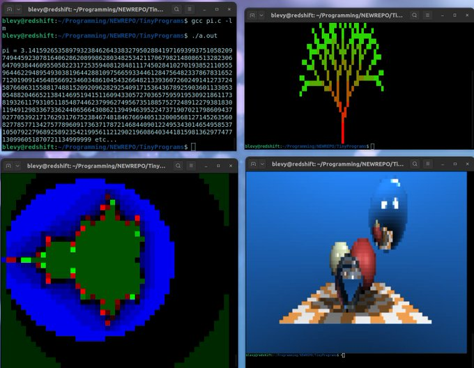

# TinyPrograms
A collection of tiny programs from various sources, for testing softcores. Includes my simple library to
render 80x25 and 80x50 "graphics" in an Ansi terminal (this makes big pixels, but they have 16 million colors !)

# How to compile

Just `gcc <program name>.c -o <program name>` and that's all. Some programs (`pi.c`,
`tinyraytracer.c`) will need to be linked with the math library (`gcc <program name>.c -lm -o <program name>`).
And of course, if you are cross-compiling (for your own RISC-V
softcore), you will need to install the RISC-V toolchain and use
`riscv-gcc` instead (more information [here](https://github.com/BrunoLevy/learn-fpga))

# Links (programs)
- Fabrice Bellard's [webpage on Pi](https://bellard.org/pi/) and [pi.c](https://bellard.org/pi/pi.c)
- Dmitry Sokolov's [TinyRaytracer](https://github.com/ssloy/tinyraytracer)
- @a1k0n Andy Sloane's [donut.c](https://gist.github.com/a1k0n/8ea6516b4946ab36348fb61703dc3194)
- Claire Wolf's [picorv](https://github.com/YosysHQ/picorv32)
- Inigo Quilez's [humanshader](https://humanshader.com/) and [division-free version](https://www.shadertoy.com/view/XflXDs)
- Sylvain Lefebre's [collection of cool graphic effects](https://github.com/sylefeb/gfxcat)

# Links (Risc-V cores)
- [learn-fpga project](https://github.com/BrunoLevy/learn-fpga) and FemtoRV
- [Tutorial Episode I: from Blinker to Risc-V](https://github.com/BrunoLevy/learn-fpga/blob/master/FemtoRV/TUTORIALS/FROM_BLINKER_TO_RISCV/README.md)
- [Tutorial Episode II: pipelining](https://github.com/BrunoLevy/learn-fpga/blob/master/FemtoRV/TUTORIALS/FROM_BLINKER_TO_RISCV/PIPELINE.md)
- [TordBoyau, a pipelined Risc-V processor](https://github.com/BrunoLevy/TordBoyau)